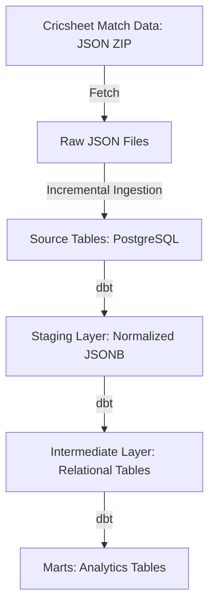
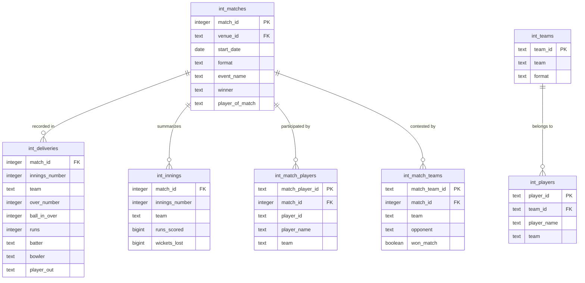

# Cricket Warehouse


A data warehouse for ball-by-ball cricket match data, designed for analytics and modeling.

The project ingests raw match JSON from [Cricsheet](https://cricsheet.org/), normalizes the data into relational tables in PostgreSQL, and builds analytical models using dbt.

## Overview

Cricsheet data is nested and complex. Each match file contains hierarchical JSON describing:

- match info
	- match dates and format
	- teams and players
	- outcomes and events
- innings
	- deliveries

This project builds a reproducible data pipeline that transforms this raw data into a structured warehouse suitable for querying and analytics.

**Pipeline stages:**

1. Fetch raw match data from Cricsheet.
2. Ingest JSON files into normalized source tables
3. Track ingestion state using file hashes for incremental updates
4. Transform and model data using dbt
5. Expose analytical tables for queries and downstream models

## Data Source

### Cricsheet

**Source:** https://cricsheet.org/

Cricsheet provides structured cricket match data across multiple formats and leagues.

Raw dataset characteristics:


- **Format:** JSON
- **Granularity:** Ball-by-ball
- **File structure:**	One file per match

## Architecture



Key design decisions:

- JSON ingestion is partially flattened during loading.
- Ingestion is incremental, tracked using file hashes.
- Transformations are implemented as dbt models
- venue metadata is managed via seed tables.


## Database Model

The warehouse stores cricket match data in normalized relational tables.

### Core models



### Layers

There are three layers of dbt DAG:

1. **Staging Models**
	 - `stg_cricsheet__match_info`: Stage match info JSONB into normalized table.
	 - `stg_cricsheet__deliveries`: Stage deliveries JSONB into normalized table.

2. **Intermediate Models**
	- `int_venues`: Each row represents a match venue.
    - `int_matches`: Each row represents a match, with columns such as
    - `int_deliveries`: Each row represents a unique match delivery.
    - `int_innings`: Each row represents a match innings, with columns such as
    - `int_teams`: Each row represents a unique (team, format) pair.
    - `int_match_teams`: Junction table for represent many to many relationship between matches and teams.
    - `int_players`: Each row represents a unique (player, team, format) tuple.
    - `int_match_players`: Junction table for represent many to many relationship between matches and players.

3. **Marts**
    - `fct_batting_order`: Batting order of each match innings.
    - `fct_dismissed_players`: Dismissed players in each match innings.
    - `fct_deliveries_sequence`: Sequence of deliveries in each innings.
    - `fct_batting_scorecard`: Batting scorecard of each innings.
    - `fct_bowling_scorecard`: Bowling scorecard of each innings.

## Quick Test Dataset

If you want to quickly test the pipeline, you can ingest a small subset of matches from Cricsheet tournament archives.

Examples:

- [ICC Women's Cricket World Cup](https://cricsheet.org/downloads/icc_womens_cricket_world_cup_json.zip)
- [Indian Premier League](https://cricsheet.org/downloads/ipl_json.zip)

### Setup

1. Follow installation instructions [below](#installation).

2. Configure your PostgreSQL database credentials and initialize the schema.

    ```shell
    cricwh configure
    cricwh init
    ```

3. Fetch and extract tournament datasets from cricsheet.

    ```shell
    cricwh fetch https://cricsheet.org/downloads/icc_womens_cricket_world_cup_json.zip
    cricwh fetch https://cricsheet.org/downloads/ipl_json.zip
    ```

4. Ingest match data and build dbt models.

    ```shell
    cricwh ingest
    dbt build
    ```

## Example Analytical Queries

Once the warehouse is built, you can use analytical marts to answer many questions such as:

### Top Runs Scorers - ICC Women's World Cup 2025

```sql
WITH stats AS (

SELECT

    COUNT(*) AS innings,
    bs.player_name AS batter,
    SUM(bs.runs) AS runs,
    SUM(bs.balls) AS balls,
    SUM(CASE WHEN bs.is_dismissed THEN 1 ELSE 0 END) AS dismissals

FROM fct_batting_scorecard bs
JOIN int_matches m USING (match_id)
WHERE
    m.event_name = 'ICC Women''s World Cup' AND
    EXTRACT( YEAR FROM m.start_date) = 2025
GROUP BY bs.player_name
)

SELECT

    batter,
    innings,
    innings - dismissals AS not_outs,
    runs,
    ROUND(runs / NULLIF(dismissals, 0), 2) AS average,
    ROUND(100.0 * runs / NULLIF(balls, 0), 2) AS strike_rate

FROM stats
ORDER BY runs DESC
LIMIT 10

```

**Output:**

```
     batter      | innings | not_outs | runs | average | strike_rate
-----------------+---------+----------+------+---------+-------------
 L Wolvaardt     |       9 |        1 |  571 |   71.38 |       98.79
 S Mandhana      |       9 |        1 |  434 |   54.25 |       99.09
 A Gardner       |       5 |        1 |  328 |   82.00 |      130.16
 Pratika Rawal   |       6 |        0 |  308 |   51.33 |       77.78
 P Litchfield    |       7 |        1 |  304 |   50.67 |      112.18
 AJ Healy        |       5 |        1 |  299 |   74.75 |      125.10
 JI Rodrigues    |       7 |        2 |  292 |   58.40 |      101.04
 SFM Devine      |       5 |        0 |  289 |   57.80 |       85.25
 HC Knight       |       7 |        1 |  288 |   48.00 |       85.71
 NR Sciver-Brunt |       6 |        0 |  262 |   43.67 |       85.34
(10 rows)
```

### Top Bowlers by Dot Balls Bowled - IPL 2025

```sql
WITH stats AS (

SELECT

    COUNT(*) AS innings,
    bs.bowler,
    SUM(bs.runs) AS runs,
    SUM(bs.balls) AS balls,
    SUM(bs.wickets) AS wickets,
    SUM(bs.dots) AS dots

FROM fct_bowling_scorecard bs
JOIN int_matches m USING (match_id)
WHERE
    m.event_name = 'Indian Premier League' AND
    EXTRACT( YEAR FROM m.start_date) = 2025
GROUP BY bs.bowler
)

SELECT

    bowler,
    innings,
    wickets,
    DIV(balls, 6)::text || '.' || MOD(balls, 6) AS overs,
    ROUND(runs / NULLIF(wickets, 0), 2) AS average,
    ROUND(6 * runs / NULLIF(balls, 0), 2) AS economy,
    dots,
    ROUND(100 * dots / NULLIF(balls, 0), 2) AS dot_ball_pct

FROM stats
ORDER BY dots DESC, dot_ball_pct DESC
LIMIT 10;
```

**Output**

```
      bowler       | innings | wickets | overs | average | economy | dots | dot_ball_pct
-------------------+---------+---------+-------+---------+---------+------+--------------
 Mohammed Siraj    |      15 |      16 | 57.0  |   32.94 |    9.25 |  151 |        44.15
 M Prasidh Krishna |      15 |      25 | 59.0  |   19.52 |    8.27 |  146 |        41.24
 KK Ahmed          |      14 |      15 | 46.4  |   29.80 |    9.58 |  137 |        48.93
 Arshdeep Singh    |      16 |      21 | 58.2  |   24.67 |    8.88 |  137 |        39.14
 JJ Bumrah         |      12 |      18 | 47.2  |   17.56 |    6.68 |  128 |        45.07
 TA Boult          |      16 |      22 | 57.4  |   23.50 |    8.97 |  127 |        36.71
 B Kumar           |      14 |      17 | 52.0  |   28.41 |    9.29 |  123 |        39.42
 JR Hazlewood      |      12 |      22 | 44.0  |   17.55 |    8.77 |  120 |        45.45
 PJ Cummins        |      14 |      16 | 49.4  |   28.13 |    9.06 |  118 |        39.60
 CV Varun          |      13 |      17 | 50.0  |   22.53 |    7.66 |  117 |        39.00
(10 rows)
```

## CLI

The project includes a CLI for managing the ingestion pipeline.

```shell
cricwh --help
Usage: cricwh [OPTIONS] COMMAND [ARGS]...                                                                                                                                    
╭─ Options ────────────────────────────────────────────────────────────╮
│ --install-completion       Install completion for the current shell. │
│ --show-completion          Show completion for the current shell, to │
│                            copy it or customize the installation.    │
│ --help                     Show this message and exit.               │
╰──────────────────────────────────────────────────────────────────────╯
╭─ Commands────────────────────────────────────────────────────────────╮
│ fetch      Fetch data from Cricsheet.                                │
│ configure  Configure cricket-warehouse.                              │
│ init       Initialize source tables and seeds.                       │
│ ingest     Ingest JSON files into source tables.                     │
│ update     Update venue city seed.                                   │
╰──────────────────────────────────────────────────────────────────────╯
```

### Configuration

A config file is provided to manage PostgreSQL database credentials. On first run, `cricwh` initializes an example config. The config file may be found at:

|Operating System |Location|
|---|---|
|**Linux/Unix** |`~/.config/cricketwarehouse/config.yaml`|
|**macOS**|`~/Library/Preferences/cricketwarehouse/config.yaml`|
|**Windows**|`C:\Users\<username>\AppData\Local\cricketwarehouse\cricketwarehouse/config.yaml`|

You can edit the configuration using the `configure` command:

```shell
cricwh configure [--init-config-file]
```

You can reset the config file using the `--init-config-file` flag in the `configure` command.

### Logs

Detailed logs are written during each command. The log file may be found at:

|Operating System |Location|
|---|---|
|**Linux/Unix** |`~/.local/share/cricketwarehouse/cricwh.log`|
|**macOS**|`~/Library/Application Support/cricketwarehouse/cricwh.log`|
|**Windows**|`C:\Users\<username>\AppData\Local\cricketwarehouse\cricketwarehouse/cricwh.log`|

## Workflow

Typical workflow:

1. Initialize source tables on first run.

	```shell
	cricwh init
	```

2. Fetch and extract raw match data.

    ```shell
    cricwh fetch [URL] [ZIP FILE PATH]
    ```

3. Seed lookup tables.

	```shell
	dbt seed
	```

4. Ingest match data into source tables.

	```shell
	cricwh ingest
	```

5. Update venue city and city-country lookup seeds.

	```
	cricwh update --seeds
	```

6. (Optional) Manually update missing city and country values in seed CSV files.
7. Run dbt models
	```shell
	dbt build
	```

The ingestion process tracks processed files using file hashes, ensuring new files are added without duplicating existing data.

## Installation

### Prerequisites

* Python 3.10+
* PostgreSQL 14+
* Git

### Clone the repository

```shell
git clone https://github.com/shsiddhant/cricket-warehouse.git
cd cricket-warehouse
```

### Create and activate a virtual environment

#### Using `uv`

```shell
uv venv .venv --seed
source .venv/bin/activate
uv sync
```

#### Using `pip`

```shell
python -m venv .venv
source .venv/bin/activate
pip install .
```

## Tools and Libraries

| Tool	      | Purpose                           |
|-------------|-----------------------------------|
| Python	  | Data ingestion and CLI tooling    |
| PostgreSQL  | Data warehouse                    |
| psycopg2	  | PostgreSQL database interface     |
| dbt	      | Data modeling and transformations |


## License

[MIT](LICENSE)
